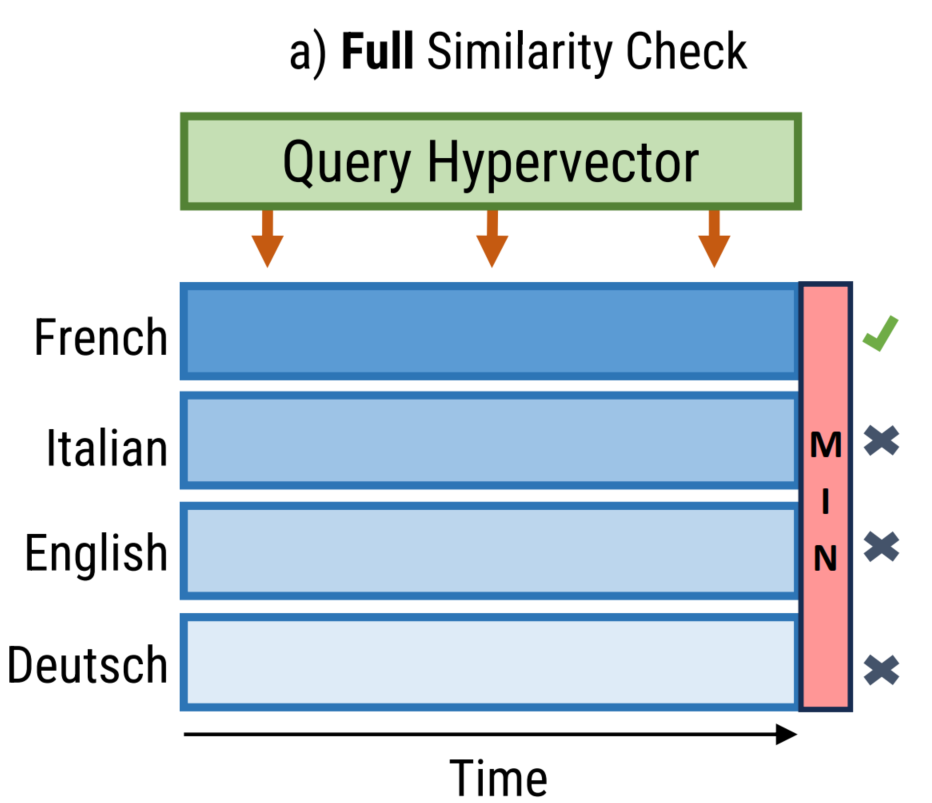
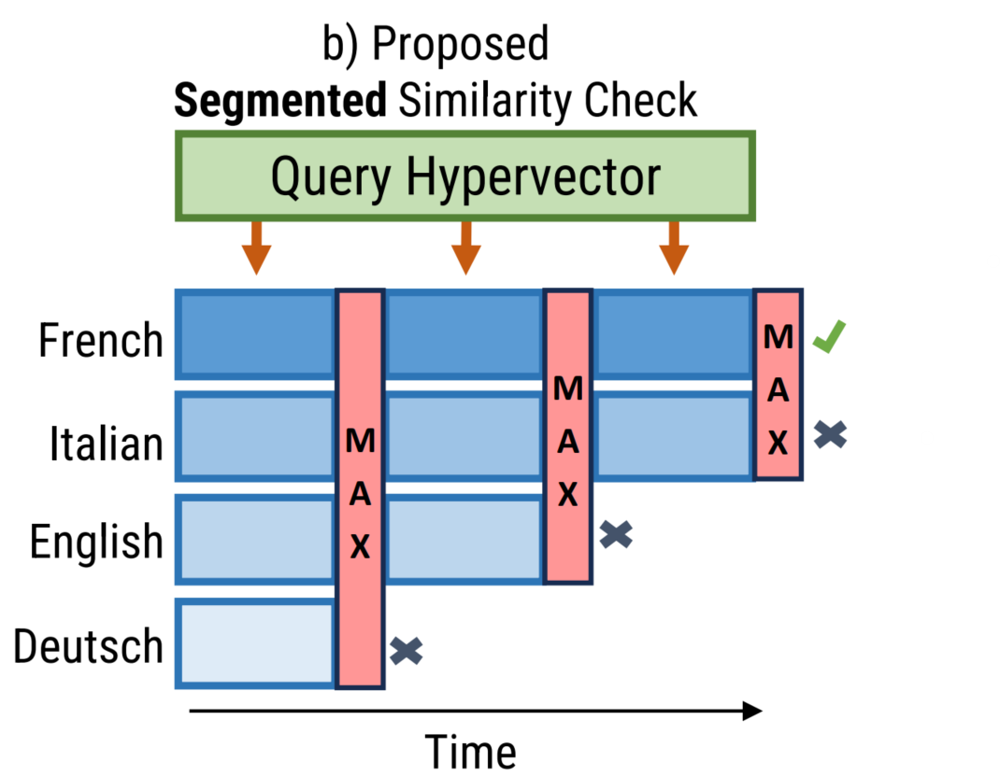

# Early Class Exclusion in Hyperdimensional Computing (ISQED)

Official repository for the paper **"Early Class Exclusion in Hyperdimensional Computing"**, accepted/presented at the **International Symposium on Quality Electronic Design (ISQED)**.

---

## 🌍 Language Options / Langues

For detailed documentation and getting started guides in other languages, please refer to:
* 🇬🇧 [**English Documentation (README-en.md)**](README-en.md)
* 🇫🇷 [**Documentation en Français (README-fr.md)**](README-fr.md)

---

## 📌 Abstract

Hyperdimensional Computing (HDC) is a lightweight machine-learning paradigm well-suited for low-resource embedded systems. However, existing HDC accelerators require full similarity checks between query and class hypervectors across all dimensions, incurring significant computational and energy overhead.

In this work, we propose the **first HDC inference algorithm capable of run-time early class exclusion**. By segmenting hypervectors and performing partial similarity checks iteratively, low-similarity classes are progressively discarded. Power gating or dynamic hardware reallocation is applied to inactive Processing Elements (PEs), drastically reducing processing activity.

### Key Results:
* **Speedup:** Up to **3.7×** latency speedup (or **5.15 MIPS** throughput via PE reallocation).
* **Energy Savings:** **28.7% to 43.5%** reduction in energy consumption per classification.
* **Accuracy:** Marginal accuracy impact (**< 3.2% loss** across benchmark datasets).

---

## 🛠️ Architecture Overview

| Full Similarity Check | Proposed Segmented Similarity Check |
| :---: | :---: |
|  |  |
| *Evaluates all $k$ classes across all $D$ dimensions.* | *Iteratively excludes the least similar candidate class at each segment step.* |

The proposed RTL accelerator architecture uses modular **Processing Elements (PEs)** built around simple XOR trees, population counters (PSUM), and accumulators (ACC), managed by an FSM controller.

---

## 📊 Datasets Evaluated

This repository includes support and experimental configurations for three benchmark datasets:
1. **ISOLET**: Audio speech/language recognition (26 classes)
2. **MNIST**: Handwritten digit recognition (10 classes)
3. **UCIHAR**: Human Activity Recognition using smartphone sensors (6 classes)

---

## 📖 Citation

If you find this work, algorithm, or hardware design useful in your research, please cite our **ISQED** paper:

```bibtex
@inproceedings{duboucheix2026early,
  title={Early Class Exclusion in Hyperdimensional Computing},
  author={Duboucheix, R{\'e}my and Asghari, Mohsen and Le Beux, S{\'e}bastien and Mohamed, Otmane Ait and Mankarious, Ron},
  booktitle={International Symposium on Quality Electronic Design (ISQED)},
  year={2026}
}